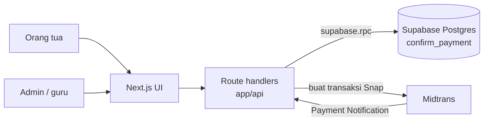
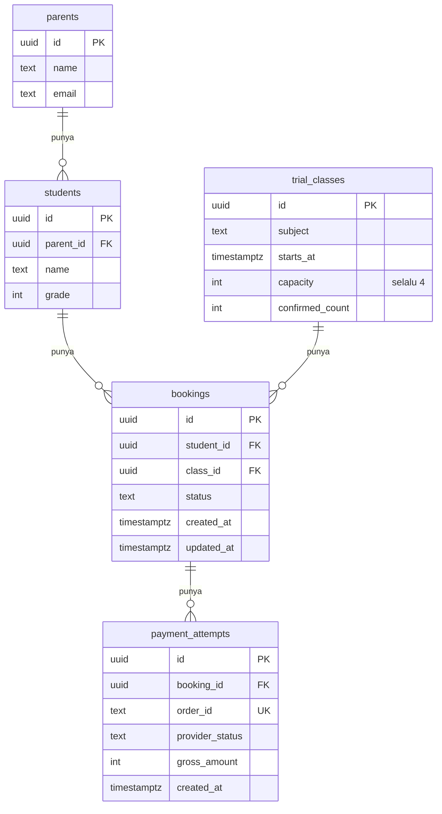
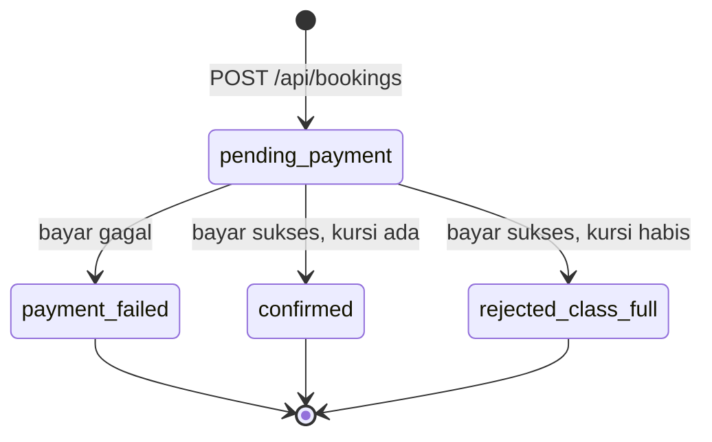
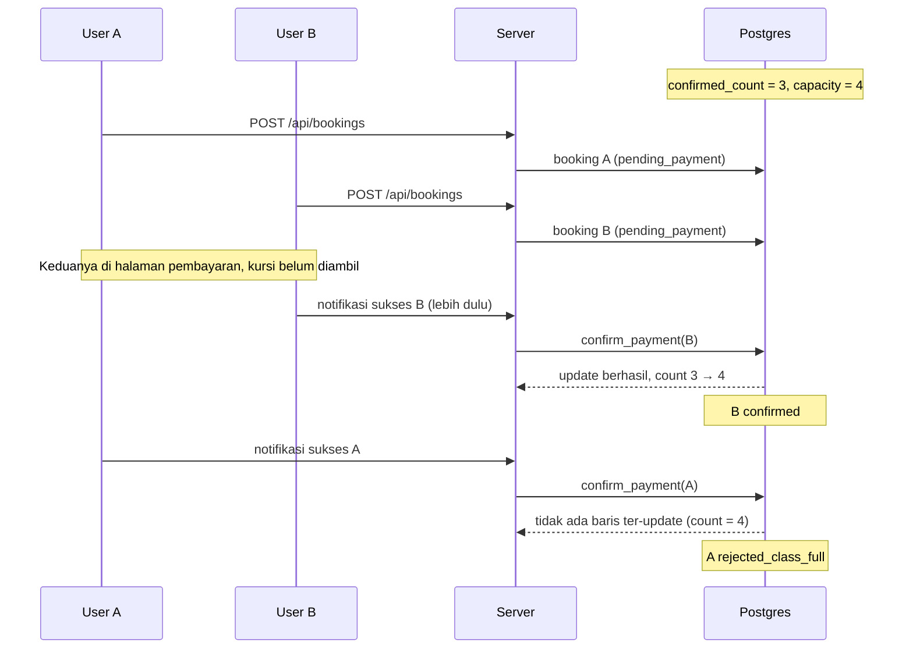

# Ottodot Trial Booking

Sistem booking kelas trial untuk kelas online live Ottodot. Orang tua memilih anak dan kelas trial, mengirim booking, membayar lewat Midtrans (sandbox), lalu melihat status booking. Admin atau guru bisa melihat roster murid terkonfirmasi untuk setiap kelas.

**Demo:** [TODO link Vercel] · **Video walkthrough:** [TODO link]

## Ringkasan

| Jaminan | Dijaga oleh | Dibuktikan oleh tes |
|---|---|---|
| Tidak ada booking ganda untuk anak dan kelas yang sama | Partial unique index di Postgres | N1, N2 |
| Tidak ada overbooking melebihi 4 murid | Update bersyarat + `CHECK (confirmed_count <= capacity)` | N3, N8, N9 |
| Anak tidak masuk roster jika pembayaran gagal | `confirm_payment` tidak menyentuh kursi saat gagal | N4, N5 |
| Hanya satu pemenang untuk kursi terakhir | Update bersyarat atomik di dalam `confirm_payment` | N8, N9 |

## Daftar Isi

1. [Cara Menjalankan](#1-cara-menjalankan)
2. [Apa yang Dibangun](#2-apa-yang-dibangun)
3. [Waktu Pengerjaan](#3-waktu-pengerjaan)
4. [Asumsi](#4-asumsi)
5. [Keputusan Arsitektur dan Backend](#5-keputusan-arsitektur-dan-backend)
6. [Yang Sengaja Tidak Dikerjakan](#6-yang-sengaja-tidak-dikerjakan)
7. [Yang Dipantau Setelah Rilis](#7-yang-dipantau-setelah-rilis)
8. [Rencana Selanjutnya](#8-rencana-selanjutnya)

---

## 1. Cara Menjalankan

### Lokal

**Kebutuhan:** Node.js 20+, project Supabase (Postgres) di supabase.com, akun Midtrans sandbox

Tidak ada database lokal. Development, tes, dan demo memakai satu project Supabase online.

```bash
npm install
npx supabase link --project-ref <project-ref>
npx supabase db reset --linked   # membuat tabel, function, dan seed data di Supabase online
cp .env.example .env.local       # isi variabel di bawah
npm run dev                      # buka http://localhost:3000
npm test                         # tes berjalan terhadap Supabase online
```

| Environment variable | Keterangan |
|---|---|
| `NEXT_PUBLIC_SUPABASE_URL` | URL project Supabase (Project Settings → API) |
| `SUPABASE_SERVICE_ROLE_KEY` | Service role key Supabase |
| `MIDTRANS_SERVER_KEY` | Server key Midtrans sandbox |
| `NEXT_PUBLIC_MIDTRANS_CLIENT_KEY` | Client key Midtrans sandbox |

> [!WARNING]
> Tes mengosongkan data. Setelah `npm test`, jalankan lagi `npx supabase db reset --linked` untuk mengembalikan seed data.

> [!NOTE]
> Webhook Midtrans butuh URL publik. Untuk mencoba pembayaran end to end di lokal, pakai tunnel seperti ngrok. Tes otomatis tidak butuh ini karena tes mengirim notifikasi bertanda tangan langsung ke webhook.

### Deploy (Vercel + Supabase)

1. Deploy ke Vercel dan isi environment variable yang sama. Database-nya project Supabase yang sama dengan di atas.
2. Di dashboard Midtrans sandbox, atur Payment Notification URL ke `https://<app>.vercel.app/api/payments/midtrans/notification`

### Seed Data

| Kelas | Terkonfirmasi | Kasus yang ditunjukkan |
|---|---|---|
| Science Trial A | 1 dari 4 | Kelas dengan kursi tersedia, dan demo booking ganda |
| Math Trial B | 3 dari 4 | Rebutan kursi terakhir |
| Science Trial C | 4 dari 4 | Kelas penuh |

- **Booking ganda:** satu anak sudah `confirmed` di Science Trial A. Coba booking anak yang sama di kelas itu.
- **Pembayaran gagal:** pakai kartu uji yang ditolak, atau biarkan transaksi kedaluwarsa di sandbox Midtrans.

### Langkah Demo Manual

[TODO]

---

## 2. Apa yang Dibangun

- **Alur booking:** pilih orang tua dan anak, pilih kelas trial, kirim booking, bayar lewat Midtrans Snap, lihat status booking
- **Webhook Midtrans:** memverifikasi signature, lalu mengonfirmasi atau menggagalkan booking
- **Roster:** halaman dan API per kelas yang hanya menampilkan murid terkonfirmasi
- **Penjaga di database:** mencegah booking ganda dan overbooking
- **Pengambilan kursi atomik:** saat pembayaran sukses, untuk menangani rebutan kursi terakhir
- **Tes otomatis:** skenario positif dan negatif, termasuk rebutan kursi terakhir

### Test Case Positif

| ID | Skenario | Hasil yang Diharapkan |
|---|---|---|
| P1 | Orang tua memilih anak dan kelas yang masih tersedia | Daftar anak dan kelas beserta sisa kursi tampil dengan benar |
| P2 | Orang tua mengirim booking | Booking dibuat dengan status `pending_payment` |
| P3 | Notifikasi Midtrans `settlement` diterima | Booking menjadi `confirmed`, `confirmed_count` bertambah 1 |
| P4 | Melihat status booking setelah dikirim | Status booking tampil sesuai kondisi terakhir |
| P5 | Admin atau guru melihat roster | Roster hanya berisi murid dengan booking `confirmed` |

### Test Case Negatif

| ID | Skenario | Hasil yang Diharapkan |
|---|---|---|
| N1 | Booking ganda untuk anak dan kelas yang sama | Ditolak dengan 409, tidak ada booking baru |
| N2 | Booking ganda dikirim bersamaan | Hanya satu booking tersimpan, yang lain 409 |
| N3 | Pembayaran sukses di kelas yang sudah penuh | Booking menjadi `rejected_class_full`, `confirmed_count` tetap 4 |
| N4 | Notifikasi Midtrans `deny`, `cancel`, atau `expire` | Booking menjadi `payment_failed`, anak tidak masuk roster, `confirmed_count` tidak berubah |
| N5 | Booking ulang setelah pembayaran gagal | Diperbolehkan, booking baru berstatus `pending_payment` |
| N6 | Notifikasi Midtrans yang sama dikirim dua kali | Hanya diproses sekali, `confirmed_count` hanya bertambah 1 |
| N7 | Notifikasi dengan signature tidak valid | Ditolak dengan 401, tidak ada perubahan data |
| N8 | Rebutan kursi terakhir, berurutan sesuai soal: A dan B booking kelas sisa 1 kursi, notifikasi sukses B masuk duluan, lalu A | B `confirmed`, A `rejected_class_full`, `confirmed_count` = 4 |
| N9 | Rebutan kursi terakhir, bersamaan: dua notifikasi sukses untuk kursi terakhir dikirim paralel dengan `Promise.all` | Tepat satu `confirmed`, satu `rejected_class_full`, `confirmed_count` = 4 |

---

## 3. Waktu Pengerjaan

[TODO] **Total: sekitar X jam**

| Bagian | Waktu |
|---|---|
| Desain dan perencanaan (sebelum commit pertama) | X menit |
| Setup, skema, seed | X menit |
| Logika backend, API, dan webhook | X menit |
| Tes | X menit |
| UI | X menit |
| README dan AI_USAGE | X menit |

---

## 4. Asumsi

- Pembayaran memakai Midtrans mode sandbox, tidak ada uang sungguhan.
- Tidak ada autentikasi. Orang tua dipilih dari dropdown untuk keperluan demo.
- Kapasitas setiap kelas trial tetap, yaitu 4 murid.
- Satu mata uang (IDR) dan satu harga trial.
- Satu anak hanya boleh punya satu booking aktif (menunggu pembayaran atau terkonfirmasi) per kelas.
- Refund tidak diproses otomatis. Booking yang perlu refund ditandai dengan status khusus agar tim bisa menindaklanjuti.
- Semua akses database dilakukan dari server memakai service role key.

---

## 5. Keputusan Arsitektur dan Backend

### Tech Stack

| Bagian | Pilihan |
|---|---|
| Frontend | Next.js (App Router), React, TypeScript, Tailwind CSS |
| Backend | Next.js Route Handlers (API dan webhook) |
| Database | Supabase (Postgres), Postgres function untuk logika atomik |
| Pembayaran | Midtrans Snap (sandbox) dengan webhook Payment Notification |
| Deployment | Vercel |
| Testing | Vitest |

### Arsitektur Aplikasi



- Halaman UI memakai React di App Router
- API dan webhook Midtrans memakai route handler (`app/api/**/route.ts`)
- Di Vercel, setiap route handler berjalan sebagai serverless function dengan URL publik, sehingga Midtrans bisa langsung mengirim notifikasi ke sana
- Logika kritis (pengambilan kursi) berada di Postgres function, bukan di route handler

<details>
<summary><b>Struktur folder</b></summary>

```
app/
  page.tsx                              halaman booking
  bookings/[id]/page.tsx                halaman status booking
  classes/[id]/roster/page.tsx          halaman roster
  _components/                          bukan route (awalan _ mengecualikannya)
    primitive/                          komponen form yang bisa dipakai ulang
      select.tsx
      input.tsx
      form-field-group.tsx              label pembungkus field
    booking-form/
      booking-form.tsx                  client component yang merangkai section
      class-list.tsx
      hooks/                            state dan pengambilan data untuk form
        use-booking-selection.ts
        use-students.ts
        use-classes.ts
  api/
    parents/[id]/students/route.ts
    classes/route.ts
    classes/[id]/roster/route.ts
    bookings/route.ts
    bookings/[id]/route.ts
    bookings/[id]/pay/route.ts
    payments/midtrans/notification/route.ts
lib/
  supabase.ts                           Supabase server client
  data/                                 satu fungsi query per file, dipakai halaman dan route handler
    list-parents.ts
    parent-exists.ts
    list-students.ts
    list-classes.ts
  http.ts                               cek uuid dan helper error JSON
  midtrans.ts                           pembuatan transaksi Snap dan verifikasi signature
supabase/
  migrations/                           skema, index, function confirm_payment
  seed.sql
tests/
  helpers/db.ts                         reset data dan fixture
  *.test.ts                             memanggil route handler langsung, tanpa server
```

</details>

### Model Data



- Satu anak bisa punya banyak booking, di kelas berbeda atau booking ulang setelah gagal bayar.
- Satu booking bisa punya banyak percobaan bayar.

**Constraint penting:**

| Constraint | Tujuan |
|---|---|
| Partial unique index `bookings (student_id, class_id) WHERE status IN ('pending_payment', 'confirmed')` | Mencegah booking aktif ganda |
| `CHECK (confirmed_count <= capacity)` pada `trial_classes` | Jaring pengaman terakhir untuk overbooking |
| `order_id` unik per percobaan bayar | Midtrans menolak `order_id` yang sama dipakai ulang |

### Status Booking



| Status | Arti |
|---|---|
| `pending_payment` | Booking dibuat, menunggu pembayaran. Belum mengambil kursi |
| `confirmed` | Pembayaran sukses dan kursi berhasil diambil |
| `payment_failed` | Pembayaran gagal, ditolak, dibatalkan, atau kedaluwarsa |
| `rejected_class_full` | Pembayaran sukses tetapi kelas sudah penuh, perlu refund |

Setiap booking hanya berpindah status satu kali dari `pending_payment`. Hanya booking `confirmed` yang muncul di roster.

### Endpoint API

Semua endpoint menerima dan mengembalikan JSON.

| Method | Endpoint | Keterangan |
|---|---|---|
| `GET` | `/api/parents/:id/students` | Daftar anak milik orang tua |
| `GET` | `/api/classes` | Daftar kelas trial beserta sisa kursi |
| `POST` | `/api/bookings` | Membuat booking `pending_payment`. 409 jika duplikat |
| `POST` | `/api/bookings/:id/pay` | Membuat transaksi Midtrans Snap, mengembalikan token atau redirect URL |
| `POST` | `/api/payments/midtrans/notification` | Webhook Midtrans. Verifikasi signature, lalu memanggil `confirm_payment` |
| `GET` | `/api/bookings/:id` | Melihat status booking |
| `GET` | `/api/classes/:id/roster` | Daftar murid terkonfirmasi |

### Mencegah Booking Ganda

Partial unique index menolak booking aktif kedua untuk anak dan kelas yang sama, termasuk dua request yang datang bersamaan. API menangkap kode error Postgres `23505` dan mengembalikan 409.

Booking yang gagal bayar tidak termasuk index, sehingga orang tua bisa booking ulang.

### Alur Pembayaran dan Penanganan Gagal Bayar

1. Orang tua menekan bayar. Server membuat transaksi Snap dan mencatat `payment_attempts`.
2. Orang tua membayar di halaman Midtrans.
3. Midtrans mengirim notifikasi ke webhook. Server memverifikasi `signature_key` (SHA512 dari `order_id`, `status_code`, `gross_amount`, dan server key). Signature tidak valid ditolak 401.
4. Status Midtrans dipetakan:

   | Status Midtrans | Arti |
   |---|---|
   | `settlement`, `capture` | Sukses |
   | `deny`, `cancel`, `expire`, `failure` | Gagal |
   | `pending` | Diabaikan |

5. Server memanggil Postgres function `confirm_payment` lewat `supabase.rpc()`.

`confirm_payment` berjalan dalam satu transaksi:

- **Jika gagal**, booking menjadi `payment_failed` tanpa menyentuh `confirmed_count`, sehingga anak tidak pernah masuk roster.
- **Jika sukses**, function mencoba mengambil kursi:

```sql
UPDATE trial_classes
SET confirmed_count = confirmed_count + 1
WHERE id = v_class_id AND confirmed_count < capacity
RETURNING id;
```

Ada baris ter-update berarti booking `confirmed`. Tidak ada berarti `rejected_class_full`.

Semua update status booking memakai `WHERE status = 'pending_payment'`, sehingga notifikasi yang dikirim ulang oleh Midtrans tidak diproses dua kali.

Logika ini ditaruh di function database karena Supabase JS client tidak mendukung transaksi multi-statement dari sisi aplikasi.

### Rebutan Kursi Terakhir

**Pendekatan:** kursi tidak ditahan saat user masuk ke pembayaran. Kursi baru diambil saat notifikasi sukses diproses oleh `confirm_payment`.



Jika kedua notifikasi masuk bersamaan, Postgres mengunci baris kelas selama update. Transaksi kedua menunggu, lalu melihat jumlah terbaru dan kondisinya gagal. Hanya satu yang bisa menang.

**Alasan memilih pendekatan ini:**

- Sesuai langsung dengan skenario soal, di mana B tetap bisa membayar walaupun A memilih kursi lebih dulu
- Jaminan kebenaran ada di database, bukan di kode aplikasi
- Cukup sederhana untuk dibangun dan diverifikasi dalam batas waktu
- Tidak butuh background job untuk mengelola masa berlaku hold kursi

**Trade-off yang diterima:**

- User A bisa sudah membayar tetapi tidak mendapat kursi, sehingga perlu refund. Ini biaya nyata dari sisi pengalaman pengguna.
- Sisa kursi di UI bisa sudah tidak akurat. Angka itu hanya petunjuk, bukan jaminan.
- Seat hold memberi pengalaman lebih baik, tetapi butuh logika kedaluwarsa (lihat [Rencana Selanjutnya](#8-rencana-selanjutnya)).

### Pembagian Pengecekan

| Lapisan | Pengecekan |
|---|---|
| **UI** | Menandai kelas penuh, menonaktifkan tombol bayar setelah diklik. Hanya untuk kenyamanan, tidak dipercaya |
| **Backend** (route handler) | Validasi input, memastikan anak milik orang tua, verifikasi signature Midtrans, menerjemahkan error database ke status HTTP |
| **Database** | Unique index untuk anti duplikat, update bersyarat dan CHECK constraint untuk anti overbooking, `confirm_payment` untuk transaksi. Sumber kebenaran terakhir |
| **Background job** | Tidak dibuat. Nantinya untuk refund `rejected_class_full` dan rekonsiliasi dengan Midtrans |

---

## 6. Yang Sengaja Tidak Dikerjakan

- Autentikasi, otorisasi, dan Row Level Security
- Seat hold dengan masa berlaku
- Refund otomatis lewat API Midtrans
- Pendaftaran reguler
- Notifikasi email ke orang tua
- Tampilan UI yang rapi

---

## 7. Yang Dipantau Setelah Rilis

| Metrik | Kenapa penting |
|---|---|
| Jumlah booking `rejected_class_full` | User yang sudah bayar tetapi kehilangan kursi |
| Tingkat kegagalan pembayaran | Masalah di sisi pembayaran atau pengalaman bayar |
| Booking yang terlalu lama di `pending_payment` | Bisa berarti webhook tidak sampai |
| Webhook yang gagal verifikasi signature atau error | Masalah konfigurasi atau percobaan pemalsuan |
| Jumlah respons 409 duplikat | UI yang membingungkan atau klik ganda |
| Pelanggaran CHECK constraint | Seharusnya tidak pernah terjadi |
| `confirmed_count` tidak sama dengan jumlah booking `confirmed` | Tanda data tidak konsisten |

---

## 8. Rencana Selanjutnya

- Seat hold singkat selama pembayaran, dengan job kedaluwarsa, untuk mengurangi kasus sudah bayar tetapi ditolak
- Refund otomatis untuk `rejected_class_full` lewat API Midtrans
- Job rekonsiliasi yang mengecek status transaksi ke Midtrans untuk booking yang tertahan di `pending_payment`
- Supabase Auth dan Row Level Security agar orang tua hanya melihat anaknya sendiri
- Notifikasi email setelah booking terkonfirmasi atau ditolak
