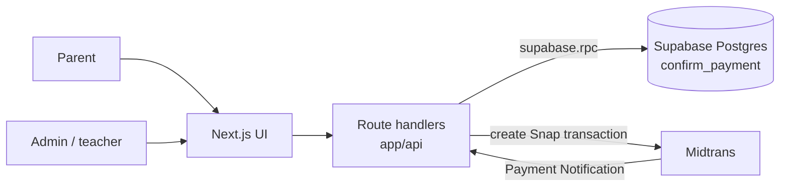
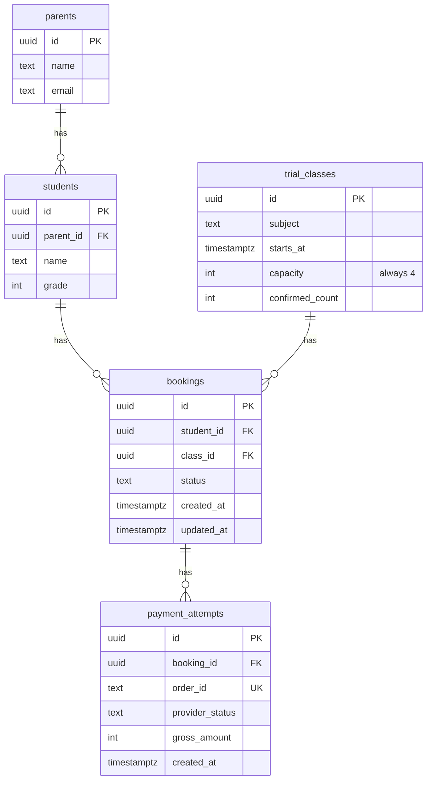
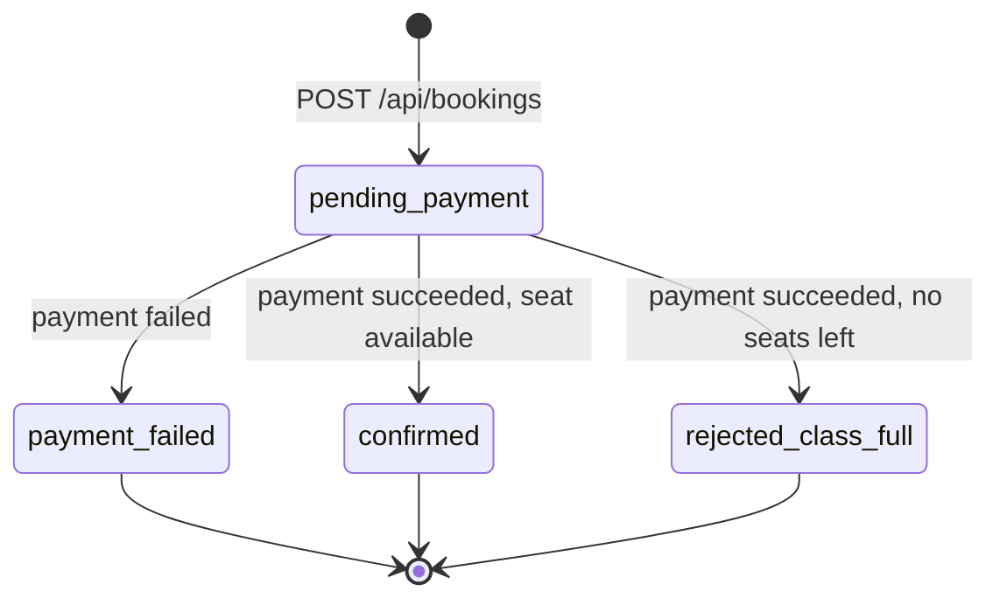
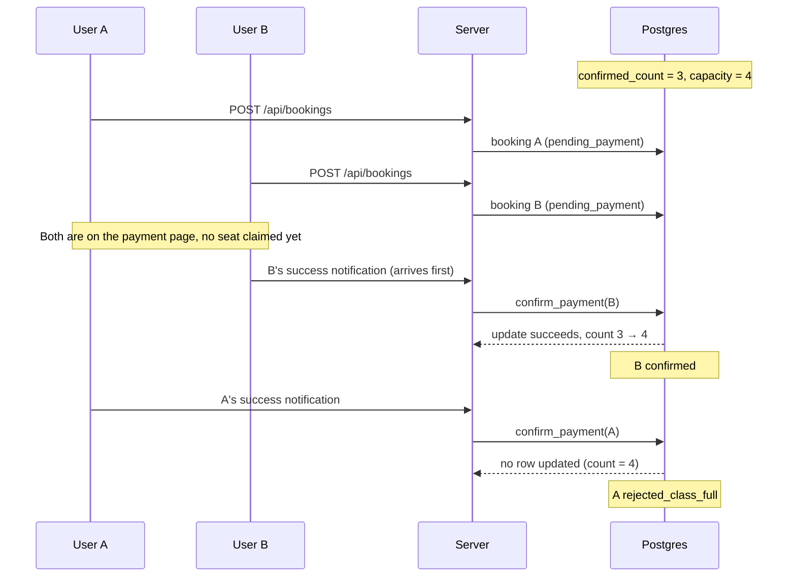

# Ottodot Trial Booking

A trial class booking system for Ottodot's live online classes. Parents choose a child and a trial class, submit a booking, pay through Midtrans (sandbox), and then see the booking status. Admins or teachers can see the roster of confirmed students for each class.

**Demo:** [TODO Vercel link] · **Video walkthrough:** [TODO link] · **Bahasa Indonesia:** [README.id.md](README.id.md)

## Summary

| Guarantee | Enforced by | Covered by tests |
|---|---|---|
| No duplicate bookings for the same child and class | Partial unique index in Postgres | N1, N2 |
| No overbooking beyond 4 students | Conditional update + `CHECK (confirmed_count <= capacity)` | N3, N8, N9 |
| A child is not added to the roster when payment fails | `confirm_payment` does not touch the seat count on failure | N4, N5 |
| Only one winner for the last seat | Atomic conditional update inside `confirm_payment` | N8, N9 |

## Table of Contents

1. [How to Run](#1-how-to-run)
2. [What Was Built](#2-what-was-built)
3. [Time Spent](#3-time-spent)
4. [Assumptions](#4-assumptions)
5. [Architecture and Backend Decisions](#5-architecture-and-backend-decisions)
6. [What Was Deliberately Cut](#6-what-was-deliberately-cut)
7. [What to Monitor After Release](#7-what-to-monitor-after-release)
8. [Next Steps](#8-next-steps)

---

## 1. How to Run

### Local

**Requirements:** Node.js 20+, a Supabase (Postgres) project on supabase.com, a Midtrans sandbox account

There is no local database. Development, tests, and the demo all use one online Supabase project.

```bash
npm install
npx supabase link --project-ref <project-ref>
npx supabase db reset --linked   # creates tables, functions, and seed data on online Supabase
cp .env.example .env.local       # fill in the variables below
npm run dev                      # open http://localhost:3000
npm test                         # tests run against online Supabase
```

| Environment variable | Description |
|---|---|
| `NEXT_PUBLIC_SUPABASE_URL` | Supabase project URL (Project Settings → API) |
| `SUPABASE_SERVICE_ROLE_KEY` | Supabase service role key |
| `MIDTRANS_SERVER_KEY` | Midtrans sandbox server key |
| `NEXT_PUBLIC_MIDTRANS_CLIENT_KEY` | Midtrans sandbox client key |

> [!WARNING]
> Tests wipe the data. After `npm test`, run `npx supabase db reset --linked` again to restore the seed data.

> [!NOTE]
> The Midtrans webhook needs a public URL. To try payment end to end locally, use a tunnel such as ngrok. The automated tests do not need this, because they send signed notifications directly to the webhook.

### Deploy (Vercel + Supabase)

1. Deploy to Vercel and set the same environment variables. The database is the same Supabase project as above.
2. In the Midtrans sandbox dashboard, set the Payment Notification URL to `https://<app>.vercel.app/api/payments/midtrans/notification`

### Seed Data

| Class | Confirmed | Case shown |
|---|---|---|
| Science Trial A | 1 of 4 | Class with available seats, and the duplicate booking demo |
| Math Trial B | 3 of 4 | Last-seat race |
| Science Trial C | 4 of 4 | Full class |

- **Duplicate booking:** one child is already `confirmed` in Science Trial A. Try booking the same child into that class.
- **Payment failure:** use a declined test card, or let the transaction expire in the Midtrans sandbox.

### Manual Demo Steps

[TODO]

---

## 2. What Was Built

- **Booking flow:** choose a parent and child, pick a trial class, submit a booking, pay through Midtrans Snap, see the booking status
- **Midtrans webhook:** verifies the signature, then confirms or fails the booking
- **Roster:** a page and API per class that shows only confirmed students
- **Database guards:** prevent duplicate bookings and overbooking
- **Atomic seat claim:** on successful payment, to handle the last-seat race
- **Automated tests:** positive and negative scenarios, including the last-seat race

### Positive Test Cases

| ID | Scenario | Expected Result |
|---|---|---|
| P1 | Parent chooses a child and a class with seats left | Children and classes are listed correctly, with remaining seats |
| P2 | Parent submits a booking | Booking is created with status `pending_payment` |
| P3 | Midtrans `settlement` notification is received | Booking becomes `confirmed`, `confirmed_count` increases by 1 |
| P4 | Viewing the booking status after submission | Status shows the latest state |
| P5 | Admin or teacher views the roster | Roster contains only students with a `confirmed` booking |

### Negative Test Cases

| ID | Scenario | Expected Result |
|---|---|---|
| N1 | Duplicate booking for the same child and class | Rejected with 409, no new booking |
| N2 | Duplicate bookings sent at the same time | Only one booking is stored, the others get 409 |
| N3 | Successful payment for a class that is already full | Booking becomes `rejected_class_full`, `confirmed_count` stays at 4 |
| N4 | Midtrans `deny`, `cancel`, or `expire` notification | Booking becomes `payment_failed`, child is not on the roster, `confirmed_count` is unchanged |
| N5 | Booking again after a failed payment | Allowed, the new booking has status `pending_payment` |
| N6 | The same Midtrans notification is sent twice | Processed only once, `confirmed_count` increases by only 1 |
| N7 | Notification with an invalid signature | Rejected with 401, no data changes |
| N8 | Last-seat race, sequential as in the brief: A and B book a class with 1 seat left, B's success notification arrives first, then A's | B `confirmed`, A `rejected_class_full`, `confirmed_count` = 4 |
| N9 | Last-seat race, concurrent: two success notifications for the last seat sent in parallel with `Promise.all` | Exactly one `confirmed`, one `rejected_class_full`, `confirmed_count` = 4 |

---

## 3. Time Spent

[TODO] **Total: about X hours**

| Part | Time |
|---|---|
| Design and planning (before the first commit) | X minutes |
| Setup, schema, seed | X minutes |
| Backend logic, API, and webhook | X minutes |
| Tests | X minutes |
| UI | X minutes |
| README and AI_USAGE | X minutes |

---

## 4. Assumptions

- Payment uses Midtrans in sandbox mode. No real money is involved.
- There is no authentication. The parent is chosen from a dropdown for demo purposes.
- Every trial class has a fixed capacity of 4 students.
- One currency (IDR) and one trial price.
- A child can have only one active booking (awaiting payment or confirmed) per class.
- Refunds are not processed automatically. Bookings that need a refund are marked with a dedicated status so the team can follow up.
- All database access happens on the server using the service role key.

---

## 5. Architecture and Backend Decisions

### Tech Stack

| Part | Choice |
|---|---|
| Frontend | Next.js (App Router), React, TypeScript, Tailwind CSS |
| Backend | Next.js Route Handlers (API and webhook) |
| Database | Supabase (Postgres), with a Postgres function for atomic logic |
| Payment | Midtrans Snap (sandbox) with the Payment Notification webhook |
| Deployment | Vercel |
| Testing | Vitest |

### Application Architecture



- UI pages use React in the App Router
- The API and the Midtrans webhook use route handlers (`app/api/**/route.ts`)
- On Vercel, each route handler runs as a serverless function with a public URL, so Midtrans can send notifications to it directly
- The critical logic (claiming a seat) lives in a Postgres function, not in a route handler

<details>
<summary><b>Folder structure</b></summary>

```
app/
  page.tsx                              booking page
  bookings/[id]/page.tsx                booking status page
  classes/[id]/roster/page.tsx          roster page
  _components/                          not a route (the _ prefix opts it out)
    primitive/                          reusable form building blocks
      select.tsx
      input.tsx
      form-field-group.tsx              label wrapper for a field
    booking-form/
      booking-form.tsx                  client component composing the sections
      class-list.tsx
      hooks/                            state and data fetching for the form
        use-booking-selection.ts
        use-students.ts
        use-classes.ts
  api/
    parents/[id]/students/route.ts
    classes/route.ts
    classes/[id]/roster/route.ts
    bookings/route.ts
    bookings/[id]/route.ts
    bookings/[id]/pay/route.ts
    payments/midtrans/notification/route.ts
lib/
  supabase.ts                           Supabase server client
  data/                                 one query function per file, shared by pages and route handlers
    list-parents.ts
    parent-exists.ts
    list-students.ts
    list-classes.ts
  http.ts                               uuid check and JSON error helper
  midtrans.ts                           Snap transaction creation and signature verification
supabase/
  migrations/                           schema, indexes, confirm_payment function
  seed.sql
tests/
  helpers/db.ts                         data reset and fixtures
  *.test.ts                             call route handlers directly, no server needed
```

</details>

### Data Model



- A child can have many bookings, in different classes or when booking again after a failed payment.
- A booking can have many payment attempts.

**Key constraints:**

| Constraint | Purpose |
|---|---|
| Partial unique index `bookings (student_id, class_id) WHERE status IN ('pending_payment', 'confirmed')` | Prevents duplicate active bookings |
| `CHECK (confirmed_count <= capacity)` on `trial_classes` | Last line of defense against overbooking |
| `order_id` unique per payment attempt | Midtrans rejects a reused `order_id` |

### Booking Statuses



| Status | Meaning |
|---|---|
| `pending_payment` | Booking created, awaiting payment. No seat claimed yet |
| `confirmed` | Payment succeeded and a seat was claimed |
| `payment_failed` | Payment failed, was denied, cancelled, or expired |
| `rejected_class_full` | Payment succeeded but the class was already full, refund needed |

Each booking moves out of `pending_payment` exactly once. Only `confirmed` bookings appear on the roster.

### API Endpoints

All endpoints accept and return JSON.

| Method | Endpoint | Description |
|---|---|---|
| `GET` | `/api/parents/:id/students` | List a parent's children |
| `GET` | `/api/classes` | List trial classes with remaining seats |
| `POST` | `/api/bookings` | Create a `pending_payment` booking. 409 on duplicate |
| `POST` | `/api/bookings/:id/pay` | Create a Midtrans Snap transaction, return the token or redirect URL |
| `POST` | `/api/payments/midtrans/notification` | Midtrans webhook. Verifies the signature, then calls `confirm_payment` |
| `GET` | `/api/bookings/:id` | Get the booking status |
| `GET` | `/api/classes/:id/roster` | List confirmed students |

### Preventing Duplicate Bookings

The partial unique index rejects a second active booking for the same child and class, including two requests that arrive at the same time. The API catches Postgres error code `23505` and returns 409.

Bookings with failed payments are not covered by the index, so parents can book again.

### Payment Flow and Handling Payment Failure

1. The parent clicks pay. The server creates a Snap transaction and records a `payment_attempts` row.
2. The parent pays on the Midtrans page.
3. Midtrans sends a notification to the webhook. The server verifies `signature_key` (SHA512 of `order_id`, `status_code`, `gross_amount`, and the server key). An invalid signature is rejected with 401.
4. Midtrans statuses are mapped:

   | Midtrans status | Meaning |
   |---|---|
   | `settlement`, `capture` | Success |
   | `deny`, `cancel`, `expire`, `failure` | Failure |
   | `pending` | Ignored |

5. The server calls the Postgres function `confirm_payment` via `supabase.rpc()`.

`confirm_payment` runs in a single transaction:

- **On failure**, the booking becomes `payment_failed` without touching `confirmed_count`, so the child never appears on the roster.
- **On success**, the function tries to claim a seat:

```sql
UPDATE trial_classes
SET confirmed_count = confirmed_count + 1
WHERE id = v_class_id AND confirmed_count < capacity
RETURNING id;
```

If a row is updated, the booking is `confirmed`. If not, it is `rejected_class_full`.

Every booking status update uses `WHERE status = 'pending_payment'`, so a notification that Midtrans resends is not processed twice.

This logic lives in a database function because the Supabase JS client does not support multi-statement transactions from the application side.

### Last-Seat Race

**Approach:** the seat is not held when a user moves to payment. The seat is claimed only when the success notification is processed by `confirm_payment`.



If both notifications arrive at the same time, Postgres locks the class row during the update. The second transaction waits, then sees the latest count and its condition fails. Only one can win.

**Why this approach:**

- It matches the scenario in the brief directly, where B can still pay even though A picked the seat first
- The correctness guarantee lives in the database, not in application code
- It is simple enough to build and verify within the timebox
- It needs no background job to manage seat hold expiry

**Trade-offs accepted:**

- User A may have paid but not get a seat, so a refund is needed. This is a real user experience cost.
- The remaining seats shown in the UI may be stale. That number is a hint, not a guarantee.
- A seat hold would give a better experience, but needs expiry logic (see [Next Steps](#8-next-steps)).

### Where Each Check Belongs

| Layer | Checks |
|---|---|
| **UI** | Marks full classes, disables the pay button after it is clicked. For convenience only, not trusted |
| **Backend** (route handler) | Input validation, checking the child belongs to the parent, Midtrans signature verification, mapping database errors to HTTP statuses |
| **Database** | Unique index against duplicates, conditional update and CHECK constraint against overbooking, `confirm_payment` for the transaction. The final source of truth |
| **Background job** | Not built. Later used for refunding `rejected_class_full` bookings and reconciling with Midtrans |

---

## 6. What Was Deliberately Cut

- Authentication, authorization, and Row Level Security
- Seat holds with expiry
- Automatic refunds through the Midtrans API
- Regular enrollment
- Email notifications to parents
- A polished UI

---

## 7. What to Monitor After Release

| Metric | Why it matters |
|---|---|
| Number of `rejected_class_full` bookings | Users who paid but lost the seat |
| Payment failure rate | Problems on the payment side or in the payment experience |
| Bookings stuck in `pending_payment` too long | May mean the webhook did not arrive |
| Webhooks that fail signature verification or error out | Misconfiguration or spoofing attempts |
| Number of 409 duplicate responses | Confusing UI or double clicks |
| CHECK constraint violations | Should never happen |
| `confirmed_count` not matching the number of `confirmed` bookings | Sign of inconsistent data |

---

## 8. Next Steps

- A short seat hold during payment, with an expiry job, to reduce cases where a user pays and is then rejected
- Automatic refunds for `rejected_class_full` through the Midtrans API
- A reconciliation job that checks transaction status with Midtrans for bookings stuck in `pending_payment`
- Supabase Auth and Row Level Security so parents only see their own children
- Email notifications after a booking is confirmed or rejected
